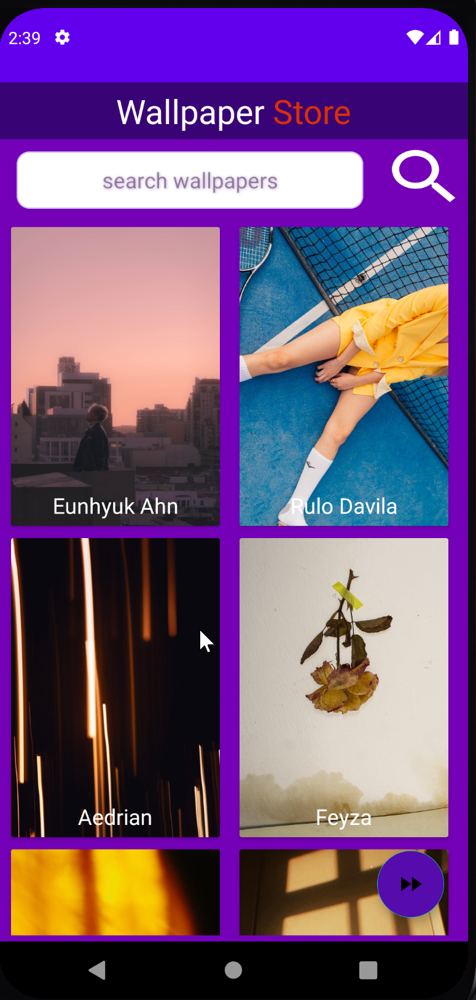
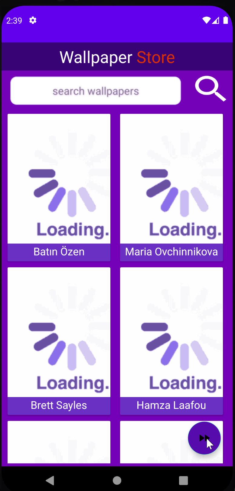
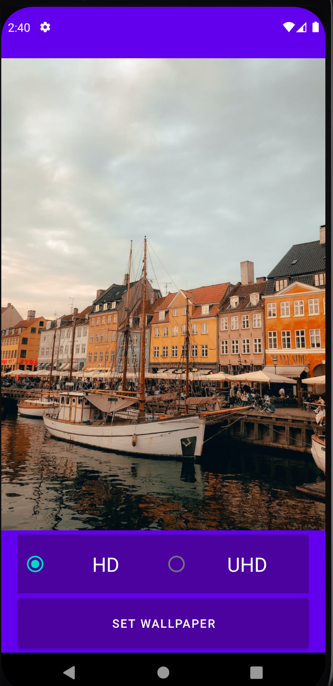
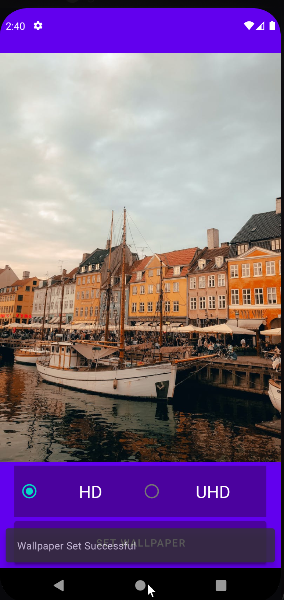
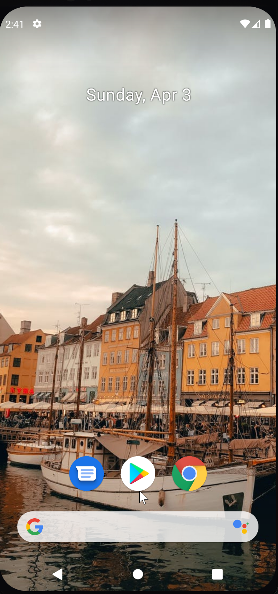

# Wallpaper Manager Powered By Pexel API

### Around Millions of Photos can browse their in this app

- Main Photo loading handling Picasso
- Setting Walpaper Engine by Wallpaper Manager
- Wallpaper setting option
    - Portrait (Medium)
    - Original (HD original)
- SnackBar
- Data Transfer one activity to another activity
- Gridview
- JSON Parsing
- Load Image From URL
- Set Image Wallpaper from URL
- Project Screenshot
    -     
    -    
    -    
    -   
    -             

## Powered By Pexel API